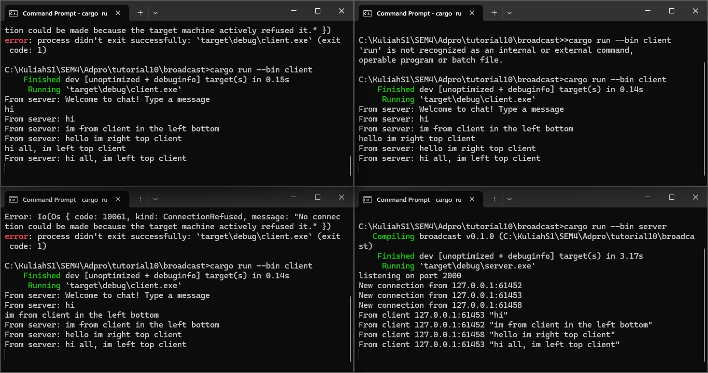

### 2.1 Explanation

Untuk menjalankan program, pertama harus dilakukan ```cargo run --bin server```. Setelahnya baru dijalankan program untuk client dengan perintah ```cargo run --bin client``` sebanyak jumlah client yang diinginkan (dalam kasus ini tiga kali). Urutan harus diikuti jika tidak program client akan bingung harus terhubung ke server mana.
Ketika ada teks yang diketik pada sisi client, akan dikirim ke server dan server mengirimkannya ke semua client yang terhubung ke server itu.