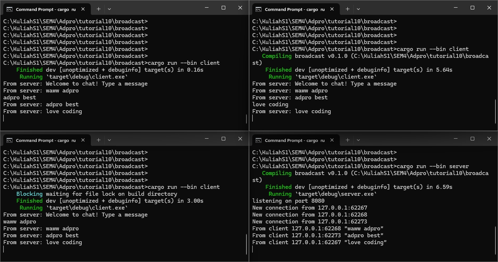
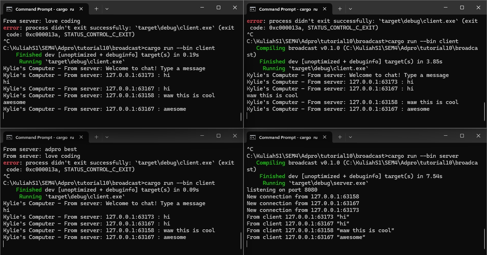

### 2.1 Explanation

Untuk menjalankan program, pertama harus dilakukan ```cargo run --bin server```. Setelahnya baru dijalankan program untuk client dengan perintah ```cargo run --bin client``` sebanyak jumlah client yang diinginkan (dalam kasus ini tiga kali). Urutan harus diikuti jika tidak program client akan bingung harus terhubung ke server mana.
Ketika ada teks yang diketik pada sisi client, akan dikirim ke server dan server mengirimkannya ke semua client yang terhubung ke server itu.

### 2.2 Explanation

Ketika mengubah port di sisi client, hal ini berarti memberi tahu client untuk terhubung ke server di port tersebut. Hal ini berarti port di sisi server juga harus diubah agar menunggu di port yang sama seperti client. Jika berbeda port, client tidak dapat tersambung ke server karena tidak bisa menemukan koneksinya ke server dan program akan error. Server akan bisa berjalan, tetapi tidak dapat bermanfaat untuk melakukan apapun karena tidak ada client yang bisa terhubung. Pada foto di atas, semua port pada sisi client dan server telah diubah sehingga program dapat berjalan seperti normal.

### 2.3 Explanation

Saya mengubah di sisi client agar sekaligus mengirimkan informasi mengenai IP dan port sender bersama dengan pesannya. Hal ini agar semua client dapat menampilkan IP dan port dari pengirim pesannya.